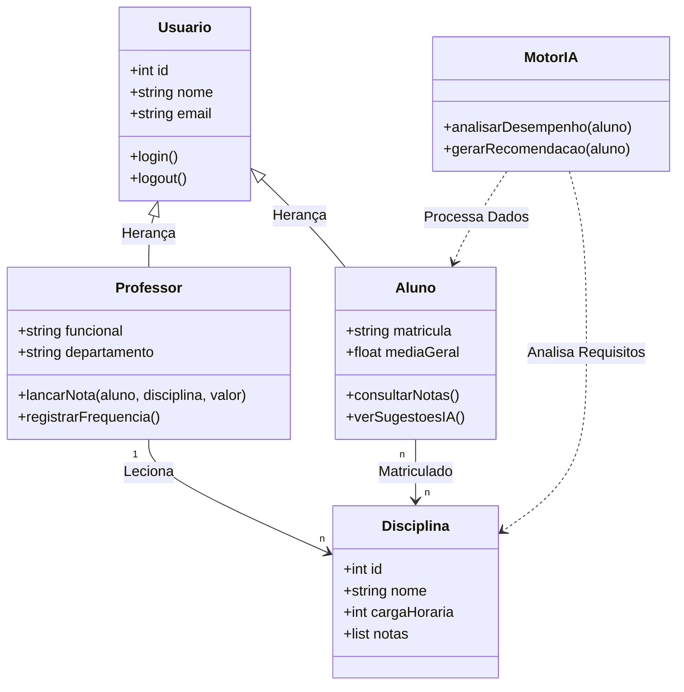

# Projeto – Pensamento Computacional para Sistemas de Larga Escala
## Plataforma Acadêmica Inteligente

### 📝 Descrição
Este projeto foi desenvolvido como parte da disciplina **Pensamento Computacional** no curso de Análise e Desenvolvimento de Sistemas (UDF), sob orientação da **Profa. Kadidja Valéria**.

O objetivo central é aplicar os quatro pilares do pensamento computacional (Decomposição, Abstração, Reconhecimento de Padrões e Algoritmos) na concepção de um sistema acadêmico robusto e escalável.

---

### 🎯 Objetivos
*   Relacionar Engenharia de Software e Pensamento Computacional.
*   Implementar princípios de segurança de **Saltzer & Schroeder** em larga escala.
*   Propor soluções para desafios de escalabilidade (milhares de usuários simultâneos).
*   Utilizar metodologias ágeis (Scrum) no planejamento.

---

### 💻 O Sistema Proposto
**Nome:** Portal Acadêmico Integrado (PAI)  
**Descrição:** Uma aplicação web de gestão acadêmica que centraliza a jornada do aluno, desde a matrícula até a formatura, com foco em personalização via IA.

---

### 🧩 Pensamento Computacional Aplicado

#### 1. Decomposição
O sistema foi dividido em microserviços independentes:
*   **Módulo de Autenticação:** Gestão de tokens e segurança.
*   **Módulo Acadêmico:** Gestão de disciplinas, notas e histórico.
*   **Módulo de Relatórios:** Painéis analíticos para coordenação.
*   **Módulo de Recomendação:** Motor de IA para sugestão de trilhas de estudo.

#### 2. Reconhecimento de Padrões
*   **Autenticação:** Padrão OAuth 2.0/JWT (comum em sistemas bancários).
*   **Interface:** Componentização de UI inspirada em padrões de LMS (Learning Management Systems) como o Blackboard.

#### 3. Abstração
Utilização de diagramas de classes e sequências para representar o fluxo de dados entre o aluno e o portal, omitindo detalhes técnicos de infraestrutura para focar na lógica de negócio.

#### 4. Algoritmos
Implementação de algoritmos para:
*   Cálculo automático de médias ponderadas.
*   Triagem de conteúdos sugeridos com base em lacunas de desempenho.

---

### 🛡️ Desafios e Segurança
*   **Escalabilidade:** Estratégia de Cache em camadas para suportar picos de acesso no fim de semestre.
*   **Princípios de Saltzer & Schroeder:** 
    *   *Least Privilege:* Alunos não possuem acesso a registros financeiros de outros usuários.
    *   *Fail-Safe Defaults:* Por padrão, nenhum usuário tem acesso a módulos sensíveis sem autenticação explícita.

---

---
### 📂 Estrutura do Repositório
*   `README.md`: Documentação principal.
*   `Design.md`: Detalhamento dos diagramas e abstrações.
*   `Desafios.md`: Lista de desafios técnicos e soluções.
*   `src/`: Protótipo inicial.

---

### 📅 Entrega
**Data:** 23/04/2026  
**Commit:** "Entrega Projeto Aula – Pensamento Computacional para Sistemas de Larga Escala"  
**Autor:** Daniel Lopes Aguiar
